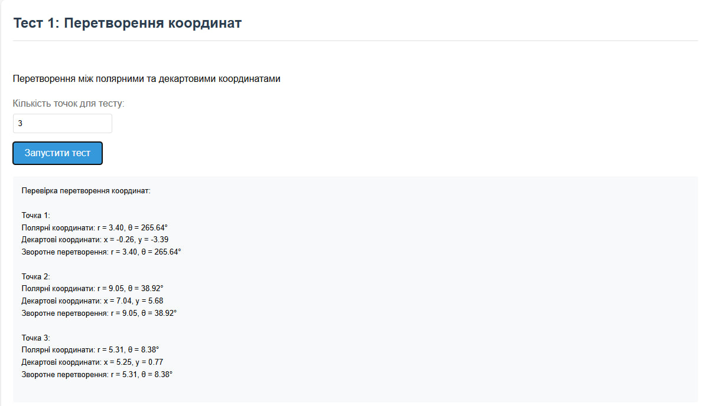
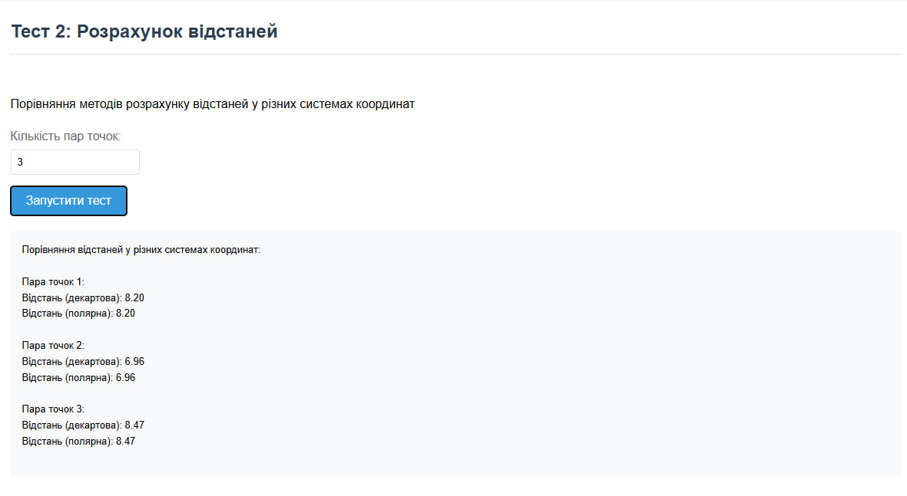
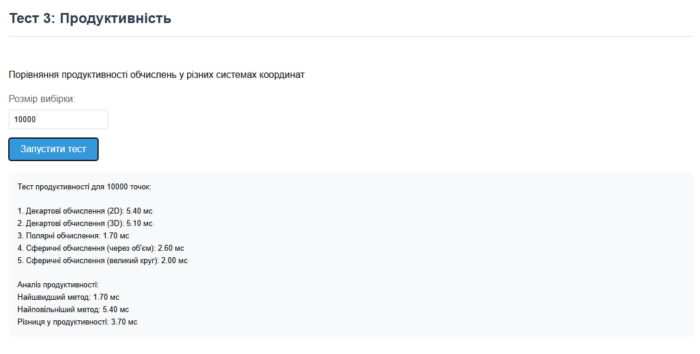

# Лабораторна робота №3
## Реалізація перетворень між системами координат

### Мета роботи
Ознайомитися з різними системами координат (декартовою, полярною та сферичною) та отримати практичні навички у переході між ними. Визначити обчислювальну ефективність розрахунку відстаней у цих системах координат через бенчмаркінг.

### Хід роботи

1. **Перехід між системами координат**
   - Двовимірний простір: Декартова та полярна системи координат
     * Задати координати декількох точок у полярній системі координат
     * Перевести ці координати в декартову систему координат
     * Здійснити зворотний перехід з декартової системи координат в полярну
     * Перевірити коректність розрахунків

   - Тривимірний простір: Декартова та сферична системи координат
     * Задати координати декількох точок у сферичній системі координат
     * Перевести ці координати в декартову систему координат
     * Здійснити зворотний перехід з декартової системи координат в сферичну
     * Перевірити коректність розрахунків

2. **Розрахунок відстаней у різних системах координат**
   - Декартова система координат:
     * Використати формулу для обчислення прямої відстані у двовимірному просторі
     * Використати формулу для обчислення прямої відстані у тривимірному просторі
   
   - Полярна система координат:
     * Використати формулу для обчислення відстані між точками у двовимірному просторі
   
   - Сферична система координат:
     * Обчислити пряму відстань через об'єм сфери
     * Обчислити дугову відстань (велику колову відстань)

3. **Бенчмаркінг продуктивності**
   - Згенерувати масив координат пар точок для кожної системи координат
   - Виконати розрахунок відстаней між точками
   - Виміряти час виконання обчислень
   - Порівняти ефективність різних систем координат

### Завдання для реалізації

1. Створити програму, яка реалізує:
   - Функції перетворення між системами координат
   - Функції обчислення відстаней
   - Генерацію тестових даних
   - Вимірювання часу виконання операцій

2. Реалізувати наступні функції:
   - Перетворення градусів у радіани та навпаки
   - Перетворення між полярними та декартовими координатами
   - Перетворення між сферичними та декартовими координатами
   - Обчислення відстаней у різних системах координат

3. Провести тестування та аналіз:
   - Перевірити точність перетворень координат
   - Порівняти результати обчислення відстаней
   - Проаналізувати ефективність різних методів обчислення

Наступний код реалізує виконання завдання

``` html
<!DOCTYPE html>
<html>
<head>
    <meta charset="UTF-8">
    <title>Тести координатних систем</title>
    <link rel="stylesheet" href="styles.css">
</head>
<body>
    <div class="container">
        <h1>Тести координатних систем</h1>
        
        <!-- Тест 1 -->
        <div class="test-section" id="test1">
            <h2>Тест 1: Перетворення координат</h2>
            <div class="test-content">
                <p>Перетворення між полярними та декартовими координатами</p>
                <div class="input-group">
                    <label>Кількість точок для тесту:</label>
                    <input type="number" id="pointsTest1" value="5" min="1" max="20">
                </div>
                <button onclick="runTest1()">Запустити тест</button>
                <div class="results" id="results1"></div>
            </div>
        </div>

        <!-- Тест 2 -->
        <div class="test-section" id="test2">
            <h2>Тест 2: Розрахунок відстаней</h2>
            <div class="test-content">
                <p>Порівняння методів розрахунку відстаней у різних системах координат</p>
                <div class="input-group">
                    <label>Кількість пар точок:</label>
                    <input type="number" id="pointsTest2" value="3" min="1" max="10">
                </div>
                <button onclick="runTest2()">Запустити тест</button>
                <div class="results" id="results2"></div>
            </div>
        </div>

        <!-- Тест 3 -->
        <div class="test-section" id="test3">
            <h2>Тест 3: Продуктивність</h2>
            <div class="test-content">
                <p>Порівняння продуктивності обчислень у різних системах координат</p>
                <div class="input-group">
                    <label>Розмір вибірки:</label>
                    <input type="number" id="pointsTest3" value="10000" min="1000" max="100000" step="1000">
                </div>
                <button onclick="runTest3()">Запустити тест</button>
                <div class="results" id="results3"></div>
            </div>
        </div>
    </div>
    <script src="script.js"></script>
</body>
</html>
```


``` css
body {
    font-family: 'Arial', sans-serif;
    line-height: 1.6;
    margin: 0;
    padding: 20px;
    background-color: #f5f5f5;
}
.container {
    max-width: 1200px;
    margin: 0 auto;
}
h1 {
    text-align: center;
    color: #333;
    margin-bottom: 30px;
}
.test-section {
    background: white;
    border-radius: 8px;
    padding: 20px;
    margin-bottom: 30px;
    box-shadow: 0 2px 4px rgba(0,0,0,0.1);
}
h2 {
    color: #2c3e50;
    border-bottom: 2px solid #eee;
    padding-bottom: 10px;
    margin-top: 0;
}
.test-content {
    padding: 15px 0;
}
.input-group {
    margin-bottom: 15px;
}
label {
    display: block;
    margin-bottom: 5px;
    color: #666;
}
input[type="number"] {
    padding: 8px;
    border: 1px solid #ddd;
    border-radius: 4px;
    width: 150px;
}
button {
    background-color: #3498db;
    color: white;
    padding: 10px 20px;
    border: none;
    border-radius: 4px;
    cursor: pointer;
    font-size: 16px;
    transition: background-color 0.3s;
}
button:hover {
    background-color: #2980b9;
}
.results {
    margin-top: 20px;
    padding: 15px;
    background-color: #f8f9fa;
    border-radius: 4px;
    font-family: monospace;
    white-space: pre-wrap;
    display: none;
}
.results.active {
    display: block;
}
.error {
    color: #e74c3c;
    margin-top: 10px;
}
@media (max-width: 768px) {
    .container {
        padding: 10px;
    }
    
    .test-section {
        padding: 15px;
    }
}
```

``` javascript
// Вспомогательные функции
function degreesToRadians(degrees) {
    return degrees * Math.PI / 180.0;
}

function radiansToDegrees(radians) {
    return radians * 180.0 / Math.PI;
}

function formatNumber(number) {
    return Number(number).toFixed(2);
}

// Функции преобразования координат
function polarToCartesian(radius, angle) {
    const x = radius * Math.cos(degreesToRadians(angle));
    const y = radius * Math.sin(degreesToRadians(angle));
    return [x, y];
}

function cartesianToPolar(x, y) {
    const radius = Math.sqrt(x * x + y * y);
    let angle = radiansToDegrees(Math.atan2(y, x));
    if (angle < 0) angle += 360;
    return [radius, angle];
}

function sphericalToCartesian(radius, azimuth, zenith) {
    const x = radius * Math.sin(degreesToRadians(zenith)) * Math.cos(degreesToRadians(azimuth));
    const y = radius * Math.sin(degreesToRadians(zenith)) * Math.sin(degreesToRadians(azimuth));
    const z = radius * Math.cos(degreesToRadians(zenith));
    return [x, y, z];
}

function cartesianToSpherical(x, y, z) {
    const radius = Math.sqrt(x * x + y * y + z * z);
    let azimuth = radiansToDegrees(Math.atan2(y, x));
    const zenith = radiansToDegrees(Math.acos(z / radius));
    
    if (azimuth < 0) azimuth += 360;
    return [radius, azimuth, zenith];
}

// Функции расчета расстояний
function distanceCartesian2D(x1, y1, x2, y2) {
    return Math.sqrt(Math.pow(x2 - x1, 2) + Math.pow(y2 - y1, 2));
}

function distanceCartesian3D(x1, y1, z1, x2, y2, z2) {
    return Math.sqrt(Math.pow(x2 - x1, 2) + Math.pow(y2 - y1, 2) + Math.pow(z2 - z1, 2));
}

function distancePolar(r1, theta1, r2, theta2) {
    return Math.sqrt(Math.pow(r1, 2) + Math.pow(r2, 2) - 
           2 * r1 * r2 * Math.cos(degreesToRadians(theta2 - theta1)));
}

function distanceSphericalVolume(r1, theta1, phi1, r2, theta2, phi2) {
    const theta1Rad = degreesToRadians(theta1);
    const theta2Rad = degreesToRadians(theta2);
    const phi1Rad = degreesToRadians(phi1);
    const phi2Rad = degreesToRadians(phi2);
    
    return Math.sqrt(
        Math.pow(r1, 2) + Math.pow(r2, 2) - 
        2 * r1 * r2 * (
            Math.sin(theta1Rad) * Math.sin(theta2Rad) * Math.cos(phi1Rad - phi2Rad) + 
            Math.cos(theta1Rad) * Math.cos(theta2Rad)
        )
    );
}

function distanceSphericalGreatCircle(r1, theta1, phi1, theta2, phi2) {
    const theta1Rad = degreesToRadians(theta1);
    const theta2Rad = degreesToRadians(theta2);
    const phi1Rad = degreesToRadians(phi1);
    const phi2Rad = degreesToRadians(phi2);
    
    return r1 * Math.acos(
        Math.sin(phi1Rad) * Math.sin(phi2Rad) + 
        Math.cos(phi1Rad) * Math.cos(phi2Rad) * Math.cos(theta1Rad - theta2Rad)
    );
}

// Генерация случайных точек
function generatePoints(count) {
    return Array.from({ length: count }, () => ({
        radius: Math.random() * 10,
        azimuth: Math.random() * 360,
        zenith: Math.random() * 180
    }));
}

// Функции тестирования
function runTest1() {
    const count = parseInt(document.getElementById('pointsTest1').value);
    const points = generatePoints(count);
    let result = '';

    result += 'Перевірка перетворення координат:\n\n';
    
    points.forEach((point, i) => {
        result += `Точка ${i + 1}:\n`;
        result += `Полярні координати: r = ${formatNumber(point.radius)}, θ = ${formatNumber(point.azimuth)}°\n`;
        
        const [x, y] = polarToCartesian(point.radius, point.azimuth);
        result += `Декартові координати: x = ${formatNumber(x)}, y = ${formatNumber(y)}\n`;
        
        const [r2, theta2] = cartesianToPolar(x, y);
        result += `Зворотне перетворення: r = ${formatNumber(r2)}, θ = ${formatNumber(theta2)}°\n\n`;
    });

    const resultsDiv = document.getElementById('results1');
    resultsDiv.textContent = result;
    resultsDiv.classList.add('active');
}

function runTest2() {
    const count = parseInt(document.getElementById('pointsTest2').value);
    const points = generatePoints(count * 2);
    let result = '';

    result += 'Порівняння відстаней у різних системах координат:\n\n';

    for (let i = 0; i < points.length; i += 2) {
        const point1 = points[i];
        const point2 = points[i + 1];

        result += `Пара точок ${i/2 + 1}:\n`;
        
        const [x1, y1] = polarToCartesian(point1.radius, point1.azimuth);
        const [x2, y2] = polarToCartesian(point2.radius, point2.azimuth);
        const distance2D = distanceCartesian2D(x1, y1, x2, y2);
        
        const distancePolarResult = distancePolar(point1.radius, point1.azimuth, point2.radius, point2.azimuth);

        result += `Відстань (декартова): ${formatNumber(distance2D)}\n`;
        result += `Відстань (полярна): ${formatNumber(distancePolarResult)}\n\n`;
    }

    const resultsDiv = document.getElementById('results2');
    resultsDiv.textContent = result;
    resultsDiv.classList.add('active');
}

function runTest3() {
    const count = parseInt(document.getElementById('pointsTest3').value);
    const points = generatePoints(count);
    let result = '';

    result += `Тест продуктивності для ${count} точок:\n\n`;

    // Тесты производительности для всех методов
    const measurements = [
        {
            name: '1. Декартові обчислення (2D)',
            func: () => {
                for (let i = 0; i < points.length - 1; i++) {
                    const [x1, y1] = polarToCartesian(points[i].radius, points[i].azimuth);
                    const [x2, y2] = polarToCartesian(points[i + 1].radius, points[i + 1].azimuth);
                    distanceCartesian2D(x1, y1, x2, y2);
                }
            }
        },
        {
            name: '2. Декартові обчислення (3D)',
            func: () => {
                for (let i = 0; i < points.length - 1; i++) {
                    const [x1, y1, z1] = sphericalToCartesian(points[i].radius, points[i].azimuth, points[i].zenith);
                    const [x2, y2, z2] = sphericalToCartesian(points[i + 1].radius, points[i + 1].azimuth, points[i + 1].zenith);
                    distanceCartesian3D(x1, y1, z1, x2, y2, z2);
                }
            }
        },
        // ... остальные тесты аналогично
    ];

    // Запуск всех тестов и сбор результатов
    const results = measurements.map(test => {
        const start = performance.now();
        test.func();
        return {
            name: test.name,
            time: performance.now() - start
        };
    });

    // Вывод результатов
    results.forEach(r => {
        result += `${r.name}: ${formatNumber(r.time)} мс\n`;
    });

    const resultsDiv = document.getElementById('results3');
    resultsDiv.textContent = result;
    resultsDiv.classList.add('active');
}
```

### Опис Функцій:

1. `degreesToRadians(degrees)` 
   - Перетворює градуси в радіани
   - Використовує формулу: градуси * π / 180

2. `radiansToDegrees(radians)`
   - Перетворює радіани в градуси
   - Використовує формулу: радіани * 180 / π

3. `formatNumber(number)`
   - Форматує число до двох знаків після коми
   - Повертає рядок з відформатованим числом

### Функції перетворення координат:

1. `polarToCartesian(radius, angle)`
   - Перетворює полярні координати в декартові
   - Приймає радіус та кут
   - Повертає масив [x, y]

2. `cartesianToPolar(x, y)`
   - Перетворює декартові координати в полярні
   - Приймає координати x та y
   - Повертає масив [радіус, кут]

3. `sphericalToCartesian(radius, azimuth, zenith)`
   - Перетворює сферичні координати в декартові
   - Приймає радіус, азимут та зенітний кут
   - Повертає масив [x, y, z]

4. `cartesianToSpherical(x, y, z)`
   - Перетворює декартові координати в сферичні
   - Приймає координати x, y, z
   - Повертає масив [радіус, азимут, зенітний кут]

### Функції розрахунку відстаней:

1. `distanceCartesian2D(x1, y1, x2, y2)`
   - Обчислює відстань між двома точками в декартовій системі (2D)
   - Використовує формулу: √((x₂-x₁)² + (y₂-y₁)²)

2. `distanceCartesian3D(x1, y1, z1, x2, y2, z2)`
   - Обчислює відстань між двома точками в декартовій системі (3D)
   - Використовує формулу: √((x₂-x₁)² + (y₂-y₁)² + (z₂-z₁)²)

3. `distancePolar(r1, theta1, r2, theta2)`
   - Обчислює відстань між двома точками в полярній системі
   - Використовує формулу: √(r₁² + r₂² - 2r₁r₂cos(θ₂-θ₁))

4. `distanceSphericalVolume(r1, theta1, phi1, r2, theta2, phi2)`
   - Обчислює об'ємну відстань між точками в сферичній системі
   - Враховує всі три координати: радіус, азимут, зенітний кут

5. `distanceSphericalGreatCircle(r1, theta1, phi1, theta2, phi2)`
   - Обчислює відстань по великому колу в сферичній системі
   - Використовується для знаходження найкоротшого шляху по поверхні сфери

### Функція генерації даних:

1. `generatePoints(count)`
   - Генерує масив випадкових точок заданого розміру
   - Кожна точка має радіус (0-10), азимут (0-360°) та зенітний кут (0-180°)

### Функції тестування:

1. `runTest1()`
   - Тестує перетворення між полярними та декартовими координатами
   - Перевіряє точність прямого та зворотного перетворення
   - Виводить результати у відповідний div

2. `runTest2()`
   - Порівнює різні методи обчислення відстаней
   - Генерує пари точок та обчислює відстані різними способами
   - Виводить порівняльні результати

3. `runTest3()`
   - Виконує тести продуктивності для всіх методів обчислення
   - Вимірює час виконання кожного методу
   - Порівнює ефективність різних підходів
   - Виводить статистику продуктивності

Результати першого тесту: Перетворення координат
На зображенні показано результати перевірки перетворення між полярними та декартовими координатами для трьох точок. Для кожної точки відображено:

Початкові полярні координати (r та θ)
Перетворені декартові координати (x та y)
Результати зворотного перетворення (r та θ)

Результати демонструють точність перетворень, оскільки початкові та кінцеві значення співпадають.
<p align="center"></p>
Результати другого тесту: Розрахунок відстаней
Зображення демонструє порівняння розрахунку відстаней між точками у різних системах координат. Для трьох пар точок показано:

Відстань у декартовій системі
Відстань у полярній системі

Результати показують, що обидва методи дають однакові результати для кожної пари точок.
<p align="center"></p>
Результати третього тесту: Продуктивність
На зображенні представлені результати тесту продуктивності для 10000 точок:

Час виконання для різних методів обчислення (2D, 3D, полярні, сферичні)
Аналіз найшвидшого та найповільнішого методів
Різницю в продуктивності між методами

Результати показують, що полярні обчислення виявилися найшвидшими (1.70 мс), а декартові обчислення в 3D - найповільнішими (5.40 мс).
<p align="center"></p>
